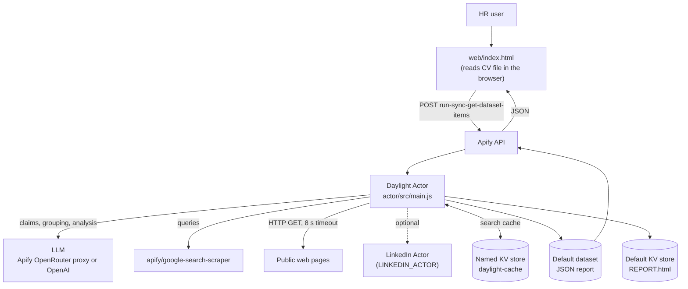
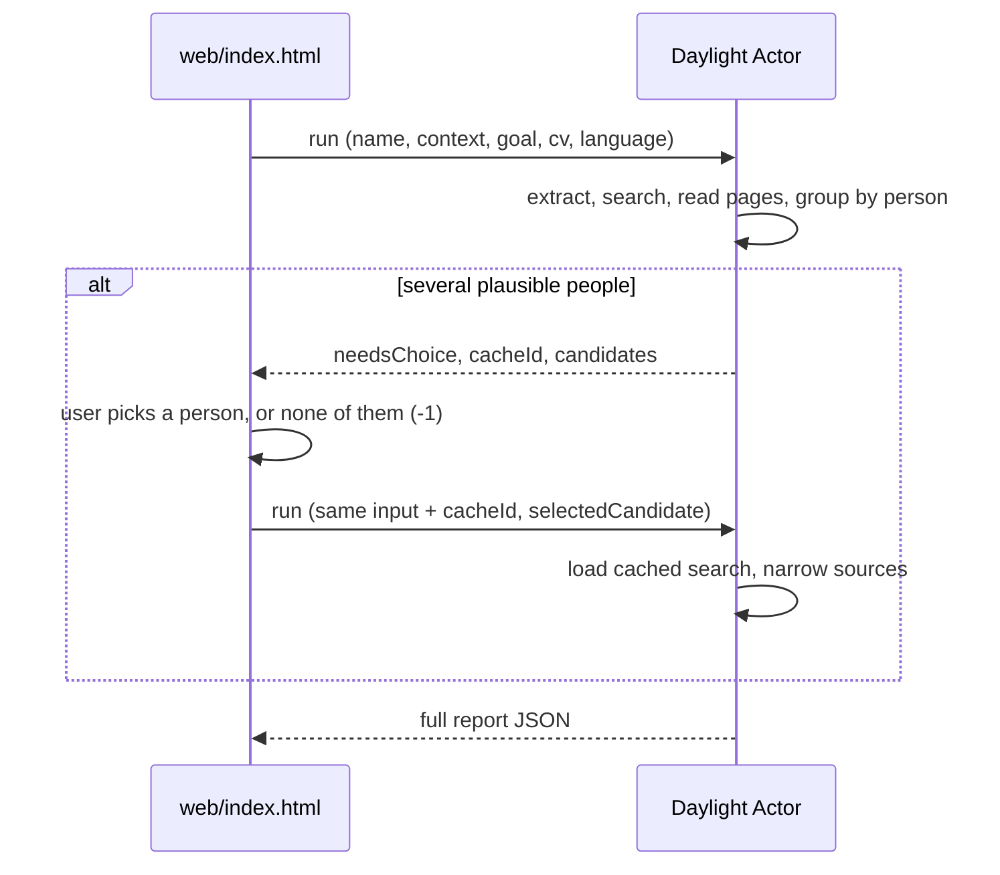

# Daylight: every claim, in the light
**FINAL REPOSITORY - https://github.com/daylighthackathon/daylighthackathon.github.io**
[](LICENSE)

Daylight checks a CV against the public web. You give it a candidate's name and CV, and it returns a report that marks every claim as **verified**, **partial**, **contradicted** or **unverifiable**. Each verdict comes with a source URL and a word-for-word quote as evidence.

It was built for the "From Dusk Till Dawn" AI agent hackathon (Social Media Deep Research track). It is a demo, not a production system. See [Security](#security) and [Known Limitations](#known-limitations).

## Table of Contents

- [Overview](#overview)
- [Features](#features)
- [Tech Stack](#tech-stack)
- [Architecture](#architecture)
- [Project Structure](#project-structure)
- [Prerequisites](#prerequisites)
- [Installation](#installation)
- [Configuration](#configuration)
- [Running the Application](#running-the-application)
- [Actor API](#actor-api)
- [Storage](#storage)
- [Testing and Validation](#testing-and-validation)
- [Security](#security)
- [Troubleshooting](#troubleshooting)
- [Common Commands](#common-commands)
- [Known Limitations](#known-limitations)
- [Team](#team)
- [License](#license)

## Overview

**The problem.** Checking a CV by hand means searching for the candidate, telling apart people with the same name, and comparing each employer, role and school with what you find. That takes a long time, and it is easy to trust an old or unrelated page.

**What Daylight does.** It pulls individual claims out of the CV, searches the web for the candidate, groups the results by person and verifies each claim only against the sources it actually fetched. It then checks the model's evidence in code: unknown URLs are removed, and a "verified" claim whose quote cannot be found in the source text is downgraded.

**Who it is for.** HR specialists and recruiters who want evidence to discuss with a candidate. Daylight does **not** decide about a candidate. It prepares evidence, flags and interview questions for a human.

**Main use cases**

- Verify employment history, education and certifications from a CV.
- Detect when public sources belong to a different person with the same name and ask the user which person is meant.
- Cross-check the CV against a LinkedIn profile (optional).
- Prepare five interview questions based on contradictions and gaps.

## Features

**Input**

- CV as a file (`.pdf`, `.docx`, `.md`, `.html`, `.txt`) or pasted text. Files are read in the browser and only the extracted text is sent.
- Optional context (company, school, city) and a free-text goal ("what HR wants to know").
- Report language: English or Czech (EN/CS switch in the page, `language` input of the Actor).

**Verification pipeline** (in `actor/src/main.js`)

- LLM extraction of up to 14 claims, plus employers and schools, from the CV.
- Google search through the Apify `apify/google-search-scraper` Actor, with general queries and targeted queries per employer and school.
- Page text download for up to 12 relevant results. LinkedIn, Facebook and Instagram pages are skipped.
- Grouping of results by person. If several people match plausibly, the run stops and asks the user to choose.
- Optional LinkedIn profile via a configurable Apify Actor, including "Open to work" and current position signals.
- Analysis split into several small LLM calls: claims in batches of 4, then profile and extra findings, the LinkedIn cross-check and the final summary.

**Checks in code** (not left to the model)

- Evidence URLs must match a fetched source (normalised: scheme, `www.`, trailing slash, `#…` and `utm_*` are ignored). Other URLs are dropped.
- Quote check: at least 75 % of the quote's words longer than 3 characters must appear in the text the model saw for that source.
- A non-unverifiable claim without evidence becomes `unverifiable`. A `verified` claim without a confirmed quote becomes `partial`.
- Identity confidence below 0.5 adds a warning. Below 0.4, every `verified` claim is downgraded to `partial`.
- If LinkedIn reports `openToWork`, the employment status is forced to `open_to_work` and a flag is added.
- E-mail addresses and phone numbers (pattern `ddd ddd ddd`, optional country code) are masked before any text reaches the model.

**Output**

- JSON report in the Actor's default dataset, rendered by the web page.
- A readable `REPORT.html` in the Actor's default key-value store.
- Run metadata: duration, number of sources and pages, verified and failed quotes, downgraded claims, model and provider.

**Web page** (`web/index.html`)

- Single HTML file, no build step.
- DEMO mode with a simulated report (including the "choose a person" step) when no Apify credentials are set.
- Live progress with a timer, the person-choice dialog and an expandable list of evidence per claim.

## Tech Stack

| Area | Technology | Where |
|---|---|---|
| Backend runtime | Node.js 20 (Docker image `apify/actor-node:20`), ES modules | `actor/Dockerfile`, `actor/package.json` |
| Backend framework | Apify SDK `apify` `^3.2.0` | `actor/package.json` |
| Web search | Apify Actor `apify/google-search-scraper` | `actor/src/main.js` |
| LLM (default) | `openai/gpt-4o-mini` through the Apify OpenRouter proxy (`https://openrouter.apify.actor`) | `actor/src/main.js` |
| LLM (optional) | OpenAI Chat Completions API directly, default model `gpt-4o-mini` | `actor/src/main.js` |
| LinkedIn (optional) | Any Apify LinkedIn profile Actor, configured by env vars | `actor/src/main.js` |
| Frontend | Plain HTML, CSS and JavaScript in one file | `web/index.html` |
| PDF reading in the browser | `pdfjs-dist@6.2.108` (legacy build) loaded on demand from cdn.jsdelivr.net | `web/index.html` |
| Team tooling | Python 3 standard library, optional `pypdf` for PDFs | `tools/daylight_tools.py` |

## Architecture

The browser calls the Apify API directly. There is no backend of its own: the Actor is the backend.



### Pipeline

1. **Input validation.** `name` and `cv` are required. The CV is cut to 12,000 characters and must be at least 150 characters long.
2. **Extract.** One LLM call returns up to 14 claims, employers and schools. Up to 8 organisations are kept.
3. **Search.** Base queries are the name, the name with the context (or with "životopis"), `site:linkedin.com/in`, talks and publications, and `site:github.com` for technical CVs. Up to 6 queries per organisation follow. Both batches run in parallel with 1 page and 6 results per query. At most 50 unique results are kept.
4. **Read pages.** Up to 12 results whose title or description contains the surname are downloaded. An excerpt of about 1,800 characters around the name is kept.
5. **Which person?** Each source is labelled `[CV match: …]` or `[NO CV match]` depending on whether it mentions words from the CV's organisations or the context. One LLM call groups the results into at most 4 people.
6. **Choice.** The run asks the user to choose when there are at least 2 people, the second one has at least 2 sources, and it is not true that the first matches at ≥ 0.75 and the second at ≤ 0.4. In that case the Actor stores the search results in `daylight-cache`, returns `needsChoice` and exits (unless `autoPick` is `true`). The second call with `cacheId` and `selectedCandidate` skips the search. Sources are then narrowed to the chosen person.
7. **LinkedIn (optional).** If `LINKEDIN_ACTOR` is set and a `linkedin.com/in/` result mentions the surname, that Actor is called (120 s timeout). The signals `openToWork`, current position and headline are placed first in the text for the model.
8. **Analysis.** Claim batches of 4 (`max_tokens` 2000 each), profile and extra findings (2000), the LinkedIn cross-check (1500) and the final summary, identity, employment status, questions and limitations (2000). A failed part is replaced by a fallback instead of failing the run.
9. **Checks in code.** See [Features](#features).
10. **Output.** `REPORT.html` goes to the default key-value store and the JSON report to the default dataset.

Each LLM call asks for a JSON object (`response_format: json_object`, temperature 0.2). If the JSON cannot be parsed, the call is retried once with a request for a shorter answer and 2,000 more tokens (up to 12,000). If that fails too, the truncated JSON is repaired by closing open strings and brackets.

### Person-choice flow



## Project Structure

```text
daylight-repo/
├── actor/                      # Apify Actor (the backend)
│   ├── .actor/
│   │   ├── actor.json          # Actor name, version, Dockerfile reference
│   │   └── input_schema.json   # Input fields shown in Apify Console
│   ├── src/
│   │   └── main.js             # Whole pipeline: prompts, search, LLM calls, checks, output
│   ├── Dockerfile              # apify/actor-node:20, npm install --omit=dev
│   ├── package.json            # "start": "node src/main.js", dependency: apify
│   └── README.md               # How to paste the Actor into Apify, env vars
├── docs/
│   └── ARCHITECTURE.md         # Pipeline description
├── tools/
│   └── daylight_tools.py       # Team helper: insert token, run tests, score results, scan for secrets
├── web/
│   └── index.html              # Frontend (single file, EN/CS, DEMO and live mode)
├── .gitignore
├── LICENSE                     # MIT
└── README.md
```

- `actor/src/main.js` holds all backend logic in one file. The prompts (`EXTRACT_PROMPT`, `SYSTEM_PROMPT`, `IDENT_PROMPT`) are written in Czech. The output language is set separately through `language`.
- Code-generated report texts live in the `STR` object (`en`, `cs`). Model-generated texts follow the `language` input.
- In the web page, all interface texts live in the `I18N` object. `APIFY_TOKEN` and `ACTOR_ID` are constants near the top of the `<script>`.

## Prerequisites

| What | Why | Notes |
|---|---|---|
| [Apify](https://apify.com) account | Hosts and runs the Actor, provides the Google search Actor and the default LLM proxy | Runs cost Apify credits (search, LLM through the proxy, optional LinkedIn Actor) |
| Apify API token | Used by the web page and the tools to start the Actor | Apify Console → Settings → API & Integrations |
| A current browser (Chrome or Edge) | Runs `web/index.html` | DOCX reading needs `DecompressionStream`; PDF reading needs internet access to cdn.jsdelivr.net |
| Optional: OpenAI API key | Call OpenAI directly instead of the Apify proxy | Set as `OPENAI_API_KEY` on the Actor |
| Optional: a LinkedIn profile Actor on Apify | LinkedIn cross-check | The original README suggests `harvestapi~linkedin-profile-scraper` |
| Optional: Python 3.8+ | `tools/daylight_tools.py` | `pip install pypdf` only if you want to test with PDF files |
| Optional: Node.js 20 | Only for running the Actor locally | The Docker image uses Node 20 |

## Installation

### 1. Deploy the Actor on Apify

This follows `actor/README.md`. There is no Apify CLI configuration in the project, so the documented way is through the Apify Console.

1. In Apify Console create a new Actor (source type: files, edited online).
2. Copy these files from `actor/` with the same paths:
   - `src/main.js`
   - `package.json`
   - `Dockerfile`
   - `.actor/actor.json`
   - `.actor/input_schema.json`
3. Optionally set environment variables (see [Configuration](#configuration)).
4. Click **Build**.
5. Note the Actor ID in the form `username~actor-name`, for example `username~daylight-verifier`. Use a tilde, not a slash.

### 2. Connect the web page

Option A, by hand: open `web/index.html` and fill in the two constants at the top of the `<script>`:

```js
const APIFY_TOKEN = "";   // your Apify API token
const ACTOR_ID = "";      // username~actor-name
```

Option B, with the helper script (run it from the repository root, because the default path is `web/index.html`):

```bash
python tools/daylight_tools.py url --token <YOUR_APIFY_TOKEN> --actor <username~actor-name>
```

The script keeps a backup of the previous version in `web/_zaloha/index.html.bak`. That folder is in `.gitignore`.

> **Never commit a filled-in token.** Before committing, run `python tools/daylight_tools.py url --clear` and `python tools/daylight_tools.py klice`.

### 3. Optional: tools dependencies

```bash
pip install pypdf   # only needed by tools/daylight_tools.py for PDF files
```

## Configuration

### Actor environment variables

Set them in Apify Console → your Actor → Source → Environment variables.

| Variable | Required | Description | Example |
|---|---|---|---|
| `LINKEDIN_ACTOR` | No | Apify Actor used to read a LinkedIn profile. The LinkedIn step is skipped when it is not set. | `harvestapi~linkedin-profile-scraper` |
| `LINKEDIN_INPUT` | No | JSON input template for that Actor. `{{URL}}` is replaced by the profile URL. Default: `{"profileUrls":["{{URL}}"]}` | `{"profileScraperMode":"Profile details no email ($4 per 1k)","queries":["{{URL}}"]}` |
| `OPENAI_API_KEY` | No | If set, OpenAI is called directly instead of the Apify OpenRouter proxy. | `sk-...` (never commit) |
| `LLM_MODEL` | No | Model override. Default: `gpt-4o-mini` with OpenAI, `openai/gpt-4o-mini` with the proxy. | `gpt-4o-mini` |
| `APIFY_TOKEN` | Set by Apify | Provided automatically when the Actor runs on Apify. Used to authenticate to the OpenRouter proxy and to call other Actors. Must be set by hand only for local runs. | — |

### Web page constants (`web/index.html`)

| Constant | Required | Description |
|---|---|---|
| `APIFY_TOKEN` | For live mode | Apify API token. Empty means DEMO mode. |
| `ACTOR_ID` | For live mode | `username~actor-name`. Empty means DEMO mode. |

The page remembers the chosen language in `localStorage` (`daylight-lang`). Without a saved value it uses the browser language (Czech or Slovak means `cs`, everything else `en`).

## Running the Application

### Web page

There is no build step and no dev server in the project. Open `web/index.html` in a browser (double-click, or drag it into the browser).

- **DEMO mode:** with empty `APIFY_TOKEN` or `ACTOR_ID` the page shows a simulated report and says so ("DEMO mode: the result is simulated").
- **Live mode:** with both constants set, the page shows "Live mode: connected to Apify". It calls the Actor with a 280 s run timeout and usually takes 1 to 3 minutes.

Workflow: fill in the candidate's name (it is guessed from the first line of an uploaded CV if the field is empty), optionally the context and goal, upload or paste the CV (at least 150 characters), and press the run button. If several people match, choose one, or choose "None of these: use only what matches the CV".

### Actor in Apify Console

You can also start the Actor directly in Apify Console with the input form defined by `input_schema.json`. The JSON report appears in the run's dataset and the readable report in **Storage → Key-value store → `REPORT.html`**.

### Actor locally (not documented by the team)

> TODO: The project has no instructions for local runs. The steps below follow standard Apify SDK behaviour (the `.gitignore` already excludes `storage/`, where the SDK keeps local data) but have not been verified for this project.

```bash
cd actor
npm install
mkdir -p storage/key_value_stores/default
# put the Actor input into storage/key_value_stores/default/INPUT.json, e.g.
# {"name": "Jana Novakova", "cv": "<at least 150 characters of CV text>", "language": "en"}
APIFY_TOKEN=<YOUR_APIFY_TOKEN> npm start
```

The token is required locally because the Actor calls `apify/google-search-scraper` and, by default, the Apify LLM proxy.

## Actor API

The web page and the tools start the Actor through the synchronous Apify endpoint. The run's dataset items come back as the response body.

| Method | Endpoint | Description | Auth |
|---|---|---|---|
| `POST` | `https://api.apify.com/v2/acts/{ACTOR_ID}/run-sync-get-dataset-items?token={APIFY_TOKEN}&timeout=280` | Runs the Actor and returns its dataset items | Apify token in the query string |

### Input

| Field | Type | Required | Description |
|---|---|---|---|
| `name` | string | Yes | Candidate's full name as in the CV |
| `cv` | string | Yes | CV as plain text, at least 150 characters; only the first 12,000 are used |
| `context` | string | No | Company, school or city, used to tell apart people with the same name |
| `goal` | string | No | What HR wants to know. Default in the prompt: "ověř tvrzení z CV" |
| `language` | `"en"` or `"cs"` | No | Report language, default `en` |
| `cacheId` | string | Internal | Set by the web page for the second call after the person choice |
| `selectedCandidate` | integer | Internal | Index of the chosen person, or `-1` for none |
| `autoPick` | boolean | Internal | `true` = never ask, pick the best match automatically (default `false`) |

Example request (values are illustrative):

```bash
curl -X POST \
  "https://api.apify.com/v2/acts/<username~actor-name>/run-sync-get-dataset-items?token=<YOUR_APIFY_TOKEN>&timeout=280" \
  -H "Content-Type: application/json" \
  -d '{
        "name": "Jana Novakova",
        "context": "Alfa s.r.o., Prague",
        "goal": "Verify Python experience and team leadership",
        "cv": "<full CV text, at least 150 characters>",
        "language": "en"
      }'
```

### Responses

The body is a JSON array. The web page reads the first item, which has one of three shapes.

**1. Report** (shape taken from the code, values are placeholders):

```json
[{
  "identityConfidence": 0.86,
  "identityReason": "…",
  "identityWarning": false,
  "identityChoice": { "mode": "single", "label": "…" },
  "summary": "…",
  "employmentStatus": { "status": "employed | open_to_work | unknown", "detail": "…" },
  "claims": [{
    "text": "…",
    "status": "verified | partial | contradicted | unverifiable",
    "confidence": 0.9,
    "evidence": [{ "url": "https://…", "snippet": "…", "quoteVerified": true }],
    "note": "…"
  }],
  "linkedinCrossCheck": [{ "cv": "…", "linkedin": "…", "match": "match | differs | missing_on_linkedin" }],
  "linkedinSignals": null,
  "extraFindings": [{ "text": "…", "url": "https://…", "snippet": "…" }],
  "profile": { "headline": "…", "timeline": [], "education": [], "publicPresence": [] },
  "flags": ["…"],
  "interviewQuestions": ["…"],
  "limitations": ["…"],
  "sources": [{ "title": "…", "url": "https://…", "description": "…", "cvMatch": ["…"] }],
  "meta": {
    "durationSec": 95, "resultsCount": 30, "pagesRead": 8, "queries": 9,
    "claimsExtracted": 10, "language": "en", "sourcesMatchingCv": 12,
    "model": "openai/gpt-4o-mini", "provider": "openrouter",
    "downgradedClaims": 2, "droppedEvidence": 1, "quotesVerified": 7, "quotesNotFound": 2,
    "linkedin": { "used": false },
    "readableReport": "…"
  }
}]
```

`identityChoice.mode` is one of `single`, `auto` (ambiguous, but `autoPick` was set), `user` (chosen by the user) or `none` (the user chose "none of them").

**2. Person choice needed:**

```json
[{
  "needsChoice": true,
  "cacheId": "c…",
  "candidates": [{
    "index": 0, "label": "…", "description": "…", "matchesCv": 0.8,
    "sources": [{ "url": "https://…", "title": "…" }]
  }],
  "meta": { "durationSec": 40, "resultsCount": 30 }
}]
```

Send the same input again with `cacheId` and `selectedCandidate` (`index` or `-1`).

**3. Error:**

```json
[{ "error": "Candidate name or CV text is missing." }]
```

The Actor catches its own errors and writes `{ "error": … }` to the dataset, so the HTTP status is still successful. Check for the `error` key.

## Storage

The project has no database. It uses Apify storages:

| Storage | Content | Lifetime |
|---|---|---|
| Default dataset of each run | The JSON report, `needsChoice` or `error` item | Apify's retention for run storages |
| Default key-value store of each run | `REPORT.html` (readable report, language from input) | Apify's retention for run storages |
| Named key-value store `daylight-cache` | Search state for the person choice: claims, organisations, queries, sources, page excerpts, candidates. Key = `cacheId` | Named store, **the Actor never deletes entries** |

## Testing and Validation

The project has no automated tests, linter, formatter, type checking or CI pipeline. Quality is checked by running real CVs and comparing the results with a hand-written ground truth, using `tools/daylight_tools.py`.

Run the commands from the repository root. On Windows use `py` instead of `python`.

```bash
# Show what text is extracted from a CV file (sends nothing)
python tools/daylight_tools.py text cv/jana.pdf

# Run one CV through the deployed Actor (token and Actor ID are read from web/index.html)
python tools/daylight_tools.py test cv/jana.pdf --jmeno "Jana Novakova" --kontext "Alfa s.r.o., Praha" --cil "Ověř Python"

# Run every CV in a folder, one after another
python tools/daylight_tools.py test cv/

# Score the results after filling in the "pravda" column (ano / ne / nelze) in vysledky/*.csv
python tools/daylight_tools.py shoda
```

- `test` saves `vysledky/pripad-<name>.json` and `.csv` and appends the run time to `vysledky/casy.txt`. It warns about `verified` claims without a URL, a number of interview questions other than 5, and runs longer than 3 minutes. It also prints the run metadata (sources, pages, quotes, downgrades, LinkedIn, model).
- `shoda` counts correct verdicts. `ano` (true) is correct as `verified` or `partial`, `ne` (false) as `contradicted` or `unverifiable`, `nelze` (true but not public) only as `unverifiable`. A `verified` claim without a URL is always wrong. It writes `ground-truth.md`.
- `vysledky/` is in `.gitignore`. TODO: commit `ground-truth.md` with the final validation numbers.
- Test only with people who have agreed to it.

> Notes from the analysis:
>
> - `test <number>` reads cases from `pripady.txt`, which is not in the repository. Use CV files instead.
> - `test` does not send `language` (the Actor defaults to `en`) or `autoPick`. If the Actor returns `needsChoice`, the tool does not handle it and saves a "report" with no claims.
> - The script's docstring still mentions `daylight.html` and "nothing to install". The actual default is `web/index.html`, and PDF files need `pypdf`.

## Security

- **The Apify token is visible in the page source** in live mode. Anyone who opens the page can start runs on your account. `docs/ARCHITECTURE.md` calls this acceptable for a demo and recommends a small backend in front of the Actor for production. Do not publish a page with a filled-in token, and rotate the token after the event.
- **Secrets scan.** `python tools/daylight_tools.py klice` looks for OpenAI keys (`sk-…`), Apify tokens (`apify_api_…`), Make webhook URLs and bearer tokens. `python tools/daylight_tools.py url --clear` empties the token constants.
- **Keep keys in Apify.** Store `OPENAI_API_KEY` as an Actor environment variable, never in the repository.
- **Personal data.** E-mails and phone numbers are masked before the model sees the text, and the prompt forbids health, politics, religion, family and private information. The phone pattern only matches 9-digit numbers in `ddd ddd ddd` form, so other formats are not masked. Page excerpts and search results stay in `daylight-cache` until you delete them. AI used in hiring is a high-risk use case in the EU and is subject to GDPR. Use only public professional information and keep a human in the loop.
- **Prompt injection.** The prompt tells the model to treat page text as data and ignore instructions in it. URLs and quotes are checked in code afterwards, so the model cannot cite a source that was not fetched.
- **XSS.** Both the web page and `REPORT.html` HTML-escape all model and source text. The web page also allows only `http(s)` links.
- **Files.** CV files are parsed in the browser. Only the extracted text is sent to Apify.

## Troubleshooting

| Symptom | Likely cause | Fix |
|---|---|---|
| Page shows "DEMO mode" | `APIFY_TOKEN` or `ACTOR_ID` is empty | Fill both in (see [Installation](#installation)) |
| "Apify returned an error 401 (wrong token)" | Invalid or expired token | Copy the token again from Apify Console → Settings → API & Integrations |
| "Apify returned an error 404 (wrong Actor ID…)" | Wrong ID format, or the Actor was not built | Use `username~actor-name` (tilde) and check that the build succeeded |
| Run button stays disabled / "The CV is too short" | Under 150 characters of CV text | Upload the full CV or paste the whole text |
| A PDF does not load: "Could not load the PDF reader (no internet?)" | No access to cdn.jsdelivr.net | Use the `.docx` or `.txt` version, or paste the text |
| "Almost no text came out of the file…" | Scanned PDF or image, nothing to extract | Export the CV as a text PDF or DOCX |
| `.doc` file is rejected ("Unsupported format…") | Old Word format | Save it as `.docx` |
| "This browser cannot unzip .docx" | Browser without `DecompressionStream` | Use a current Chrome or Edge |
| "The Actor returned no data" or a timeout | Run exceeded the 280 s timeout or failed | Open the run in Apify Console → Runs and read the log |
| "Error in the Actor: …" | Exception inside the Actor (e.g. missing input, LLM HTTP error) | Read the message and the run log; with `OPENAI_API_KEY` set, check the key and credit |
| Claims show "(This part could not be processed.)" | An LLM call failed or returned invalid JSON twice | Run again; check the log for `Část "…" selhala` |
| Report has many "unverifiable" claims | Little public information, or sources narrowed to the wrong person | Add `context` (company, city) and run again; this can also be a correct result |
| No "CV vs. LinkedIn" section | `LINKEDIN_ACTOR` not set, no LinkedIn result mentioning the surname, or the LinkedIn Actor failed | Check the env vars and the log (`LinkedIn aktor selhal`) |
| `tools/daylight_tools.py`: "Nemám token a Actor" | Token not in `web/index.html` and no `--token/--actor` | Run `url --token … --actor …` or pass both flags |
| `tools/daylight_tools.py`: "knihovna pypdf není nainstalovaná" | PDF without `pypdf` | `pip install pypdf` |

## Common Commands

```bash
# Install (Actor dependencies, only for local runs)
cd actor && npm install

# Start the Actor locally (unverified, see "Actor locally")
cd actor && APIFY_TOKEN=<YOUR_APIFY_TOKEN> npm start

# Connect / disconnect the web page (from the repository root)
python tools/daylight_tools.py url --token <YOUR_APIFY_TOKEN> --actor <username~actor-name>
python tools/daylight_tools.py url --clear

# Test runs and scoring
python tools/daylight_tools.py text cv/jana.pdf
python tools/daylight_tools.py test cv/
python tools/daylight_tools.py shoda

# Before committing
python tools/daylight_tools.py klice
```

There are no build, lint or automated test commands in the project.

## Known Limitations

- Only public web pages are searched. Social networks are not read, and LinkedIn only if `LINKEDIN_ACTOR` is configured.
- Many pages are outdated. The prompt tells the model to verify current employment only with a current source and never to mark it `verified` when LinkedIn shows "Open to work". This is a prompt rule, not a code check. In code, LinkedIn "Open to work" only forces `employmentStatus` to `open_to_work` and adds a flag.
- People with the same name can still be mixed up. Identity confidence is the model's estimate, not a certainty.
- **Unverifiable does not mean untrue.**
- The quote check compares words, not exact text. A paraphrase that reuses most words can pass, and a quote broken by page formatting can fail.
- At most 50 search results and 12 downloaded pages per run. JavaScript-rendered pages return little or no text.
- The CV is cut to 12,000 characters, and at most 14 claims are checked.
- A run takes about 1 to 3 minutes and is stopped after 280 s when started from the web page.
- LLM output is limited to about 2,000 tokens per call (the code notes this as a limit of the Apify proxy), so the analysis is split into several calls.
- The search queries always include Czech words ("životopis", "přednáška OR konference OR publikace OR rozhovor"), regardless of `language`.
- The Apify token in the page makes live mode unsuitable for public deployment.

> Notes from the analysis:
>
> - `docs/ARCHITECTURE.md` says low identity confidence "downgrades verified". In the code, a warning appears below 0.5, but `verified` is downgraded only below 0.4.
> - The input schema labels in `actor/.actor/input_schema.json` are partly Czech and partly English.

## Team

Erik, Max.

## License

[MIT](LICENSE), © 2026 Daylight team.
